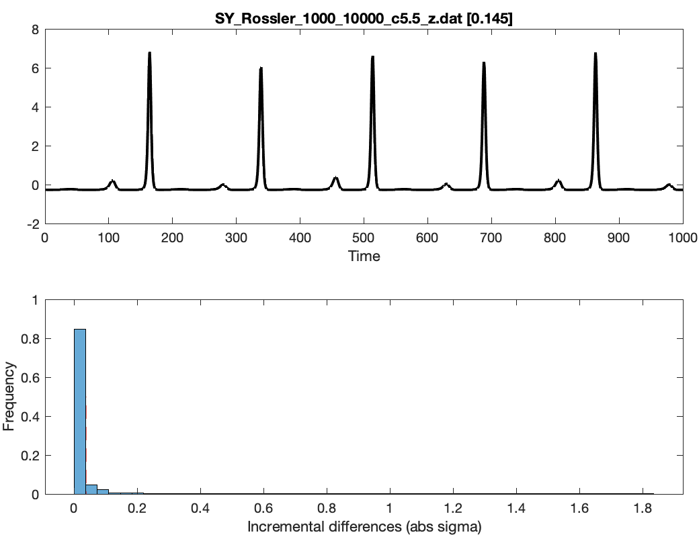

# Incremental differences

_catch22_ contains **2** features which are each based on the properties of the 1-point incremental differences of the time series. Select one of the cards below to discover more information:

<table data-view="cards"><thead><tr><th></th><th align="center"></th><th></th><th data-hidden data-card-target data-type="content-ref"></th></tr></thead><tbody><tr><td></td><td align="center"><strong><code>high_fluctuation</code></strong></td><td></td><td><a href="incremental-differences.md#id-1.-high_fluctuation">#id-1.-high_fluctuation</a></td></tr><tr><td></td><td align="center"><strong><code>whiten_timescale</code></strong></td><td></td><td><a href="incremental-differences.md#id-2.-whiten_timescale">#id-2.-whiten_timescale</a></td></tr></tbody></table>

***

## 1. `high_fluctuation`

### What it does

[`high_fluctuation`](#user-content-fn-1)[^1] computes the proportion of difference magnitudes that are greater than 4% of the standard deviation of the time series.

This feature will give low values to series that have periods in which the series stays approximately constant (within $$0.04\sigma$$), and high values to series that do not (e.g., they 'jump around a lot' from point to point). Note that the threshold of $$0.04\sigma$$ is small: most noisy or irregular time series have values close to 1 (e.g., about 0.98 for uncorrelated Gaussian noise), so this feature mainly distinguishes smooth or finely sampled time series (which have lower values) from everything else.

This is a common statistic to measure about heart rate time series, cf. "[_The pNNx files: re-examining a widely used heart rate variability measure_](https://www.ncbi.nlm.nih.gov/pmc/articles/PMC1767394/)_"_, J.E. Mietus et al., Heart 88(4) 378 (2002).



The[ Rossler attractor](https://en.wikipedia.org/wiki/R%C3%B6ssler_attractor) time series below has many near-constant stretches (Just 14.5% of all step increments are larger than $$0.04\sigma$$), yielding a **low value** for this statistic:

<figure><figcaption></figcaption></figure>

### **Feature output:** `high_fluctuation`**`=`**<mark style="color:red;">**`0.145`**</mark>



These log returns of opening prices of a stock, on the other hand, fluctuate a lot more: 95% of successive increments exceed the $$0.04\sigma$$ threshold, yielding a **high value** for this statistic:

<figure><figcaption></figcaption></figure>

### **Feature output:** `high_fluctuation`**`=`**<mark style="color:red;">**`0.952`**</mark>



***

## 2. **`whiten_timescale`**

### What it does

[`whiten_timescale`](#user-content-fn-2)[^2] computes:

1. The set of incremental differences between successive pairs of time-series values (imagining this as the set of residuals from a naive 1-point forecast).
2. Computes the first zero-crossing of the autocorrelation function for the residuals, `tau_resid`, and for the original time series, `tau`.
3. Returns the ratio of these two values, `tau_resid/tau`.



Here's an example of a time series, where the autocorrelation function (black, lower plot) decays slowly due to slower trends in the time series (black, upper plot), whereas the incremental differences (blue in the upper plot) are much noisier, leading to a rapid drop of the autocorrelation function, and reduction in the first zero-crossing from 15 -> 1:

<figure><figcaption></figcaption></figure>

### **Feature output: `whiten_timescale =`**<mark style="color:red;">**`0.0667`**</mark>



By contrast, in this [AR(2)](https://en.wikipedia.org/wiki/Autoregressive_model) time series, the increments are still highly autocorrelated, and we end up with a value of the feature near 1:

<figure><figcaption></figcaption></figure>

### **Feature output: `whiten_timescale =`**<mark style="color:red;">**`0.833`**</mark>



***

[^1]: **Naming info:** This matches the _hctsa_ feature named `MD_hrv_classic_pnn40`

[^2]: **Naming info:** This feature matches the feature called `FC_LocalSimple_mean1_tauresrat` in _hctsa_. It is the `tauresrat` output of running the code `FC_LocalSimple(x_z,'mean',1)` in _hctsa._
